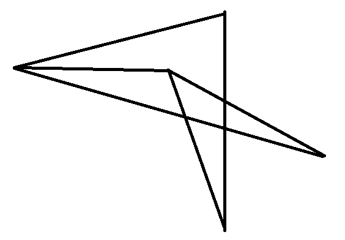
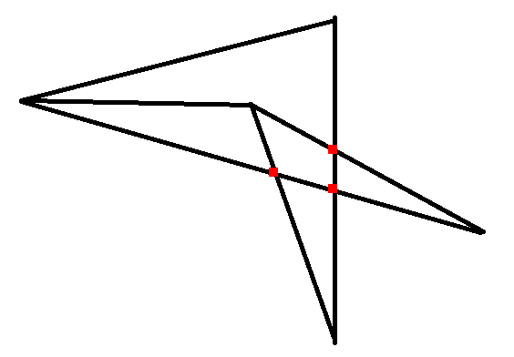

# 1C_admission_graph_intersections
Решение задачи с отбора на кафедру КИС 1С

# Условие
На вход программе подаётся изображение некоторого графа. 
Необходимо вывести количество пересечений его рёбер. Обратите внимание - рёбра, встречающиеся в одной вершине, не дают пересечения. 

Формат изображения - png. Рёбра изображены прямыми чёрными отрезками толщиной не менее 3 пикселей. Гарантируется, что никакие два ребра, выходящие из одной вершины, не лежат на одной прямой. 

Дополнительно можете передавать в программу количество вершин в графе.

# Как это работает
Изображение считывается в массив булей, затем каждая закрашенная точка проверяется на то, что она является пересечением двух рёбер.
Если это так, мы сохраняем её и помечаем, что в области вокруг неё больше не может быть других точек-пересечений.

Алгоритм, проверяющий, что точка является пересечением: 
- Фиксируем некоторую длину вектора
- Перебираем несколько углов от нуля до `pi`
- Откладываем от точки вектор с этой длиной и таким углом, а также противоположный ему
- Проверяем, что полученные точки - черного цвета. Если это так, то проверяем еще пару раз для векторов меньших длин
- Если это выполнено - ура, через точку проходит ребро. Если через точку проходит больше одного ребра - ура, мы нашли точку пересечения!

# Используемые библиотеки
- Pillow - для считывания изображения в массив и для сохранения файла с помеченными пересечениями
- NumPy - для более удобной работы с массивами

Как обычно, всё это можно установить командой `pip install -r requirements.txt`.

# Примеры использования
- `python intersections.py {image.png}` - обрабатывает изображение, выводит в `stdout` результат.
- `python intersections.py {image.png} -v {n}` - то же самое, но на вход еще подаётся число вершин в графе.
- `python intersections.py {image.png} -s {res.png}` - выводит в `stdout` результат, а также сохраняет результат с помеченными пересечениями. Результат выглядит так.

# Прочие комментарии
Не стал разбивать скрипт на отдельные файлы, так как код получился не очень большим и довольно цельным. 

К каждому методу написаны docstring-и, кратко описывающие их функции, а также типы, которые они принимают. В целом старался писать "самодокументирующийся" код.
